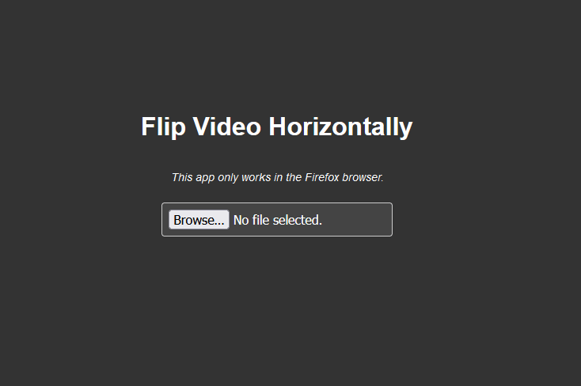

# Flip Video Horizontally

This is a javascript app that flips a video horizontally in the browser with ffmpeg.wasm



## Installation

Clone the repository and install dependencies.

```bash
$ git clone https://github.com/Hal51AI/GestureJS.git
$ cd GestureJS
$ npm install
```

## Usage

To start the application

```bash
$ npm run dev
```